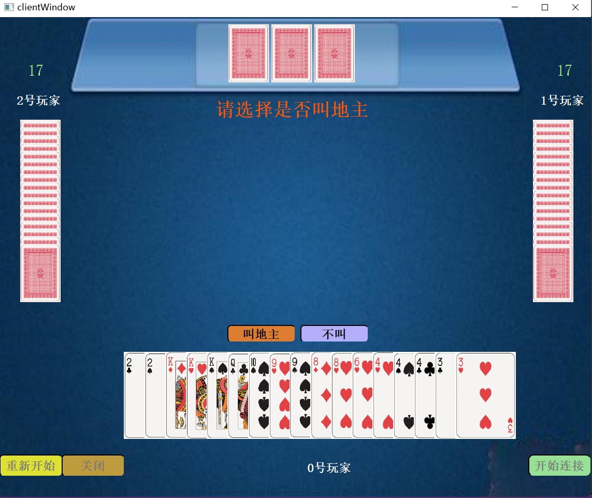

# doudizhu
A doudizhu(斗地主) game made with QT
My homework when I was freshman. The code is nearly **unreadable**, but I don't want to change it.

There's no release version. If you **really** want to play it, use Qt to open the project and build it please. （This is because I wrote the IP address in the code)

```
QT 5.13.0
Desktop Qt 5.13.0 MinGW 64-bit
```

To run the game, you need to set the appropriate IP in `mainwindow.cpp: MainWindow::initserver()` and `clientwindow.cpp: clientWindow::connectHost()`. And open a server and 3 clients which is set in `main.cpp`.



